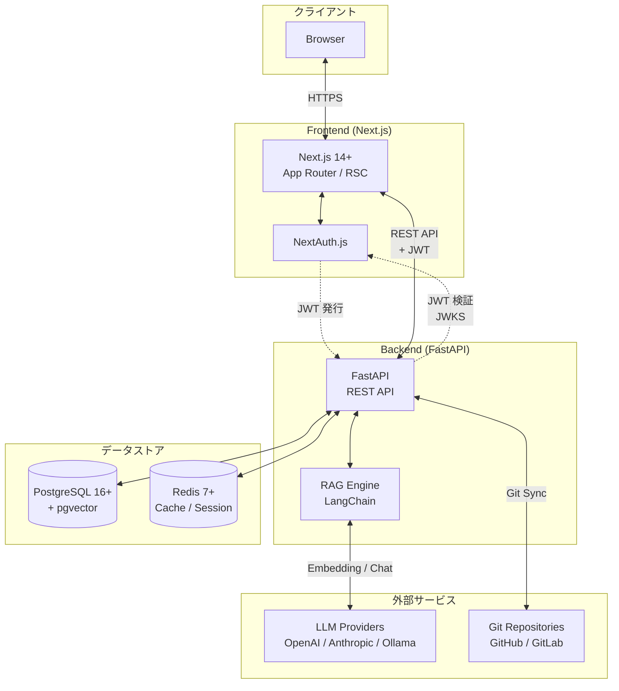
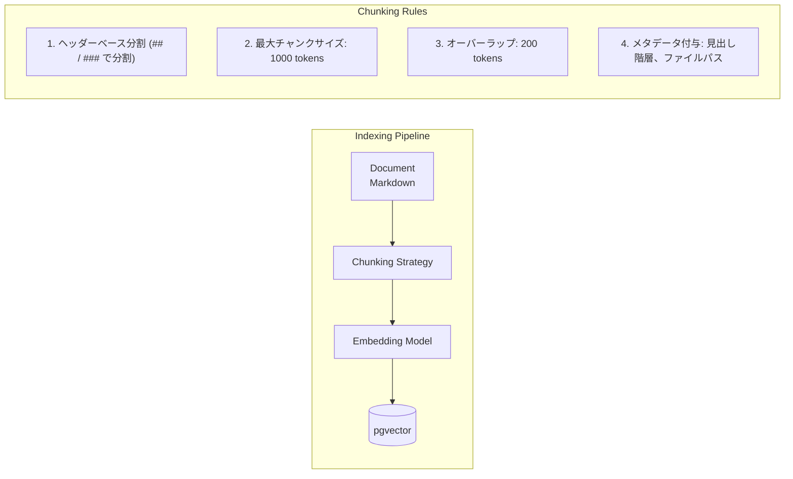
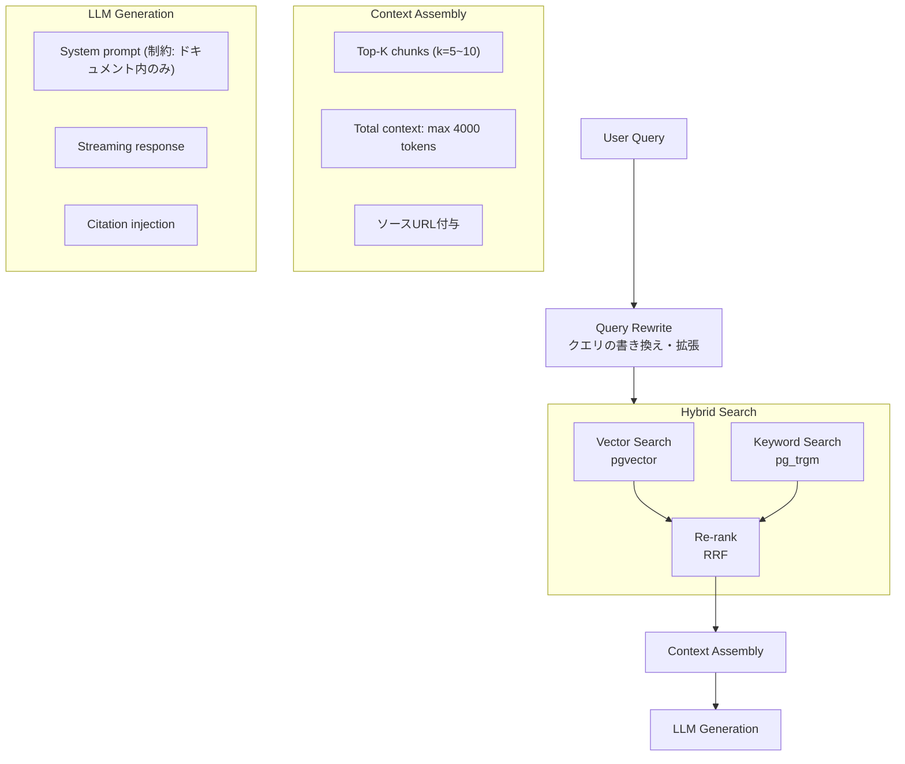
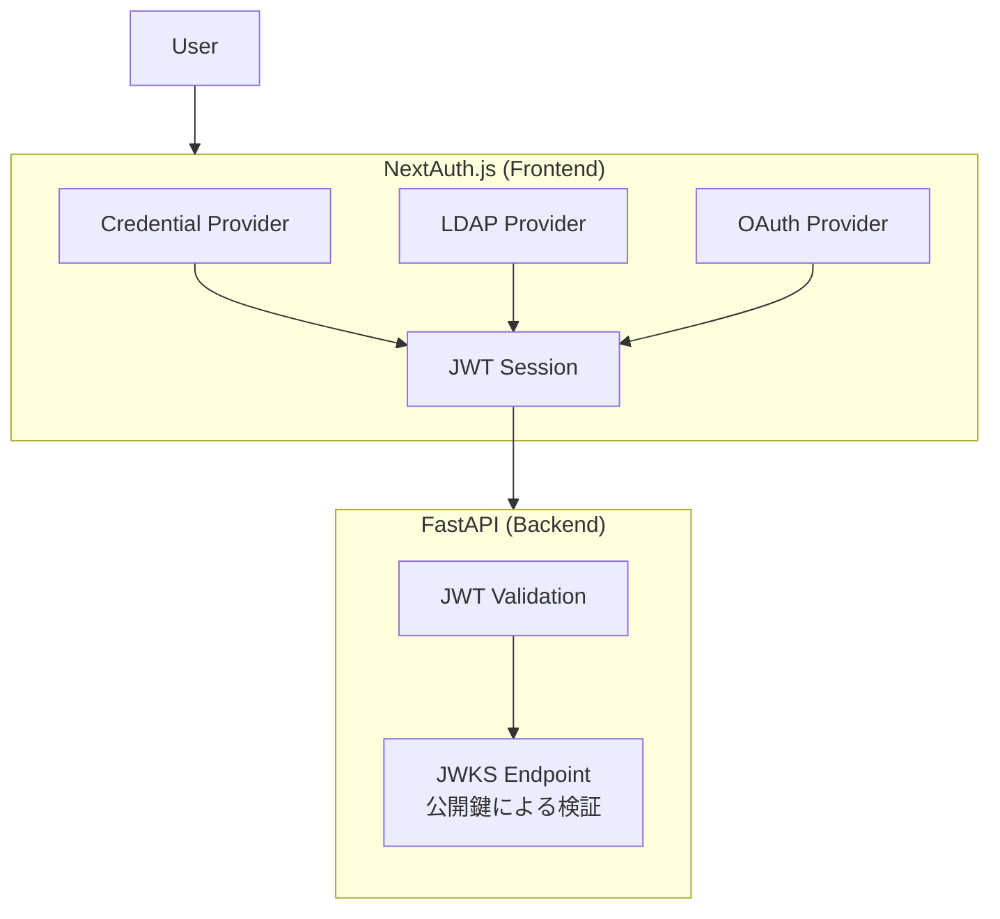
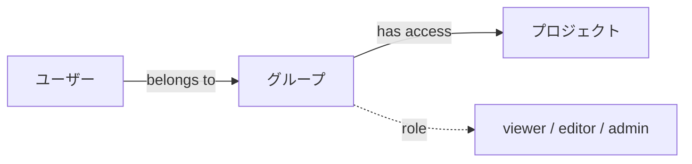

# ragxuary

> RAG ネイティブなドキュメンテーションツール

ドキュメントを書いて公開するだけでなく、そのドキュメントをナレッジベースにした AI チャットを提供する。

---

## 目次

1. [概要](#概要)
2. [アプリケーションアーキテクチャ](#アプリケーションアーキテクチャ)
3. [ターゲットユーザー](#ターゲットユーザー)
4. [技術スタック](#技術スタック)
5. [機能要件](#機能要件)
6. [非機能要件](#非機能要件)
7. [URL 設計](#url設計)
8. [データベース設計](#データベース設計)
9. [API 設計](#api設計)
10. [RAG アーキテクチャ](#ragアーキテクチャ)
11. [認証・認可](#認証認可)
12. [デプロイメント](#デプロイメント)
13. [MVP 定義](#mvp定義)

---

## 概要

### プロダクトビジョン

ragxuary は、技術ドキュメントの作成・公開・検索を一元化し、AI による自然言語での質問応答を可能にするプラットフォームである。

### 主要な価値提案

- **ドキュメント作成**: マークダウンベースの直感的なエディタ
- **公開・共有**: プロジェクト単位での公開/非公開設定
- **AI 検索**: RAG ベースの自然言語検索・質問応答
- **セルフホスト**: エンタープライズ環境での完全なデータ主権

---

## アプリケーションアーキテクチャ

### システム構成図



### コンポーネント概要

| コンポーネント | 役割 |
|---------------|------|
| Next.js | UI レンダリング、ルーティング、認証 UI |
| NextAuth.js | 認証・セッション管理（JWT） |
| FastAPI | REST API、ビジネスロジック |
| RAG Engine | ドキュメント検索、LLM 連携 |
| PostgreSQL | データ永続化、ベクトル検索（pgvector） |
| Redis | セッションキャッシュ、レート制限 |

---

## ターゲットユーザー

### 個人開発者

- OSS プロジェクトのドキュメント公開
- 個人ナレッジベースの構築

### チーム・スタートアップ

- 社内ドキュメントの整備
- 新メンバーオンボーディング効率化

### エンタープライズ

- 大規模ナレッジベースの構築
- LDAP による既存認証基盤との統合
- オンプレミス・プライベートクラウドでの運用

---

## 技術スタック

### フロントエンド

| 技術                  | バージョン | 用途                      |
| --------------------- | ---------- | ------------------------- |
| Next.js               | 16+        | App Router 使用、RSC 活用 |
| React                 | 19+        | UI ライブラリ             |
| TypeScript            | 5+         | 型安全性                  |
| TailwindCSS           | 4+         | スタイリング              |
| shadcn/ui             | latest     | UI コンポーネント         |
| NextAuth.js           | 5+         | 認証                      |
| CodeMirror            | 6+         | マークダウンエディタ      |
| TanStack Query        | 5+         | サーバー状態管理          |
| Zustand               | 4+         | クライアント状態管理      |
| next-intl             | 4+         | 国際化（i18n）            |
| Vitest                | 3+         | 単体・統合テスト          |
| React Testing Library | 16+        | コンポーネントテスト      |
| Playwright            | 1.50+      | E2E テスト                |
| MSW                   | 2+         | API モック                |
| Biome                 | 2+         | リンター・フォーマッター  |

### バックエンド

| 技術           | バージョン | 用途                     |
| -------------- | ---------- | ------------------------ |
| FastAPI        | 0.110+     | REST API                 |
| Python         | 3.11+      | ランタイム               |
| SQLAlchemy     | 2.0+       | ORM                      |
| Pydantic       | 2.0+       | バリデーション           |
| GitPython      | 3.1+       | Git 連携                 |
| LangChain      | 0.2+       | RAG フレームワーク       |
| pgvector       | 0.5+       | ベクトル検索             |
| pytest         | 8+         | テストフレームワーク     |
| pytest-asyncio | 0.25+      | 非同期テスト             |
| pytest-cov     | 5+         | カバレッジ計測           |
| httpx          | 0.28+      | API テスト用クライアント |
| Faker          | 30+        | テストデータ生成         |
| ruff           | 0.9+       | リンター・フォーマッター |

### インフラストラクチャ

| 技術           | バージョン | 用途                               |
| -------------- | ---------- | ---------------------------------- |
| Docker         | 24+        | コンテナ化                         |
| Docker Compose | 2.20+      | オーケストレーション               |
| PostgreSQL     | 16+        | データベース                       |
| Redis          | 7+         | キャッシュ・セッション・レート制限 |
| Nginx          | 1.25+      | リバースプロキシ                   |

---

## 機能要件

### F1: ドキュメンテーション

#### F1.1 プロジェクト管理

- プロジェクトの作成・編集・削除
- プロジェクトメタデータ（名前、説明、アイコン、公開設定）
- プロジェクトスラッグ（URL 用識別子）の設定

#### F1.2 ドキュメント閲覧

- マークダウンレンダリング（GFM 準拠）
- シンタックスハイライト
- 目次自動生成（見出しベース）
- ページ間ナビゲーション
- パンくずリスト
- ダークモード対応

#### F1.3 検索機能

- プロジェクト内全文検索
- 検索結果ハイライト
- 検索クエリサジェスト
- フィルタリング（日付、作成者）

#### F1.4 国際化（i18n）

##### 対応言語

| 言語   | コード | 厳密度   | 備考           |
| ------ | ------ | -------- | -------------- |
| 日本語 | ja     | **MUST** | デフォルト言語 |
| 英語   | en     | **MUST** | グローバル対応 |

##### 翻訳対象

| 対象                             | 厳密度     | 備考                         |
| -------------------------------- | ---------- | ---------------------------- |
| UI テキスト（ボタン、ラベル）    | **MUST**   | 基本的な国際化               |
| エラーメッセージ                 | **MUST**   | ユーザー体験に直結           |
| 日付・数値フォーマット           | **SHOULD** | ロケール依存の表示           |
| RAG チャットのシステムプロンプト | **SHOULD** | 言語に応じた応答             |
| メール通知テンプレート           | **MAY**    | 将来的な拡張                 |
| ドキュメントコンテンツ自体       | **対象外** | ユーザーが管理するコンテンツ |

##### 言語切り替え機能

- パスベースのロケール切り替え（`/{locale}/...`）【**MUST**】
- ヘッダーに言語セレクター配置【**MUST**】
- ユーザー設定での優先言語保存【**SHOULD**】
- ブラウザの Accept-Language ヘッダーによる自動検出【**SHOULD**】
- ロケールなしの URL はブラウザ設定に基づきリダイレクト【**MUST**】

### F2: エディタ

#### F2.1 基本編集機能

- マークダウンエディタ（WYSIWYG 風プレビュー）
- 2 ペインレイアウト（エクスプローラ / エディタ）
- リアルタイムプレビュー
- ファイルツリー表示
- ドラッグ&ドロップでファイル移動

#### F2.2 Web 編集モード

- ブラウザ内で直接編集
- 自動保存（デバウンス付き）
- 編集履歴（Undo/Redo）
- 画像アップロード

#### F2.3 Git 連携モード

- リポジトリ URL 指定
- ブランチ選択
- ドキュメントルートフォルダ指定（例: `/docs`）
- Pull（手動 / Webhook 自動同期）
- 読み取り専用（コンフリクト防止のためブラウザ編集は無効化）

##### Git 認証方式

| 方式        | 対象                      |
| ----------- | ------------------------- |
| HTTPS + PAT | GitHub, GitLab, Bitbucket |
| SSH Key     | 任意の Git サーバー       |
| GitHub App  | GitHub（推奨）            |

### F3: RAG チャット

#### F3.1 チャット UI

- Cursor 風の 3 ペインレイアウト（Explorer / Document / Chat）
- ストリーミングレスポンス
- チャット履歴（会話ごと）
- コードブロックのコピー機能
- 引用元ドキュメントへのリンク

#### F3.2 RAG 動作仕様

- ドキュメント内容のみを情報源とする
- 回答不可時の明示的な応答（「ドキュメントに記載がありません」）
- 複数ドキュメントからの情報統合
- ソース引用の明示

#### F3.3 LLM プロバイダー

| プロバイダー    | モデル例                           |
| --------------- | ---------------------------------- |
| OpenAI          | gpt-4o, gpt-4o-mini                |
| Anthropic       | claude-4-5-sonnet, claude-4-5-opus |
| Ollama          | gpt-oss, qwen3                     |
| OpenAI 互換 API | Azure OpenAI, LocalAI 等           |

### F4: 管理機能

#### F4.1 ユーザー管理

- ユーザー一覧・検索
- ユーザー作成・編集・無効化
- グループ割り当て
- API 利用制限設定

#### F4.2 グループ管理

- グループ作成・編集・削除
- メンバー管理
- プロジェクトアクセス権設定

#### F4.3 プロジェクト設定

- 公開/非公開切り替え
- アクセス権限（閲覧者/編集者/管理者）
- Git 連携設定
- チャット機能の有効/無効

#### F4.4 システム設定

- LLM プロバイダー設定
- 埋め込みモデル設定
- デフォルトレート制限
- LDAP 接続設定

---

## 非機能要件

### NFR1: パフォーマンス

| 項目                 | 目標値         |
| -------------------- | -------------- |
| ドキュメント表示     | < 500ms (TTFB) |
| 検索応答             | < 1s           |
| RAG チャット初回応答 | < 3s           |
| 同時接続ユーザー     | 1,000+         |

### NFR2: セキュリティ

- HTTPS 必須
- CSRF 保護
- XSS 対策
- SQL インジェクション対策
- レート制限
- 監査ログ

### NFR3: 可用性

- 目標稼働率: 99.9%
- ヘルスチェックエンドポイント
- グレースフルシャットダウン

### NFR4: スケーラビリティ

- ステートレスなアプリケーション設計
- 水平スケーリング対応
- データベースコネクションプーリング

### NFR5: 運用性

- 構造化ログ出力（JSON）
- メトリクス公開（Prometheus 形式）
- バックアップ・リストア手順
- 設定の環境変数化

### NFR6: テスト品質

| 項目                     | 目標（SHOULD） | 必須閾値（MUST） |
| ------------------------ | -------------- | ---------------- |
| バックエンドカバレッジ   | 80%+           | 70%              |
| フロントエンドカバレッジ | 70%+           | 60%              |
| 重要ビジネスロジック     | 90%+           | 80%              |
| E2E テスト成功率         | 99%+           | 95%              |
| CI テスト実行時間        | < 10 分        | < 15 分          |
| フレーキーテスト率       | < 1%           | < 5%             |

---

## URL 設計

### ルート構成

> **注**: `{locale}` は `ja` または `en`。ロケールなしの URL はブラウザ設定に基づきリダイレクト。

| パス                                                 | 説明                 | 認証           |
| ---------------------------------------------------- | -------------------- | -------------- |
| `/{locale}`                                          | ダッシュボード       | 要             |
| `/{locale}/login`                                    | ログイン             | 不要           |
| `/{locale}/register`                                 | 新規登録             | 不要           |
| `/{locale}/projects`                                 | プロジェクト一覧     | 要             |
| `/{locale}/bookmarks`                                | ブックマーク         | 要             |
| `/{locale}/notifications`                            | 通知                 | 要             |
| `/{locale}/p/{projectSlug}`                          | docs へリダイレクト  | 要             |
| `/{locale}/p/{projectSlug}/info`                     | プロジェクト情報     | 要             |
| `/{locale}/p/{projectSlug}/docs`                     | ドキュメントトップ   | 要             |
| `/{locale}/p/{projectSlug}/docs/{...docPath}`        | ドキュメントページ   | 要             |
| `/{locale}/p/{projectSlug}/edit`                     | エディタトップ       | 要（編集権限） |
| `/{locale}/p/{projectSlug}/edit/{...docPath}`        | ドキュメント編集     | 要（編集権限） |
| `/{locale}/p/{projectSlug}/chat`                     | RAG チャット         | 要             |
| `/{locale}/p/{projectSlug}/chat/{conversationId}`    | チャット履歴         | 要             |
| `/{locale}/p/{projectSlug}/activity`                 | プロジェクト活動履歴 | 要             |
| `/{locale}/p/{projectSlug}/settings`                 | プロジェクト設定     | 要（管理権限） |
| `/{locale}/settings`                                 | 設定トップ           | 要             |
| `/{locale}/settings/personal`                        | 個人設定             | 要             |
| `/{locale}/settings/admin`                           | 管理画面トップ       | 要（管理者）   |
| `/{locale}/settings/admin/users`                     | ユーザー管理         | 要（管理者）   |
| `/{locale}/settings/admin/groups`                    | グループ管理         | 要（管理者）   |
| `/{locale}/settings/admin/models`                    | モデル設定           | 要（管理者）   |

### Next.js App Router 構成

```
app/
├── [locale]/                                 # ロケール対応ルート
│   ├── (auth)/                               # 認証関連（Route Group）
│   │   ├── login/page.tsx                    # /{locale}/login
│   │   └── register/page.tsx                 # /{locale}/register
│   ├── (main)/                               # メインコンテンツ（Route Group）
│   │   ├── page.tsx                          # /{locale} (ダッシュボード)
│   │   ├── projects/page.tsx                 # /{locale}/projects
│   │   ├── bookmarks/page.tsx                # /{locale}/bookmarks
│   │   ├── notifications/page.tsx            # /{locale}/notifications
│   │   ├── p/[projectSlug]/                  # プロジェクト関連
│   │   │   ├── page.tsx                      # /{locale}/p/{projectSlug} → docs へリダイレクト
│   │   │   ├── info/page.tsx                 # /{locale}/p/{projectSlug}/info
│   │   │   ├── docs/
│   │   │   │   ├── page.tsx                  # /{locale}/p/{projectSlug}/docs
│   │   │   │   └── [...docPath]/page.tsx     # /{locale}/p/{projectSlug}/docs/{...docPath}
│   │   │   ├── edit/
│   │   │   │   ├── page.tsx                  # /{locale}/p/{projectSlug}/edit
│   │   │   │   └── [...docPath]/page.tsx     # /{locale}/p/{projectSlug}/edit/{...docPath}
│   │   │   ├── chat/
│   │   │   │   ├── page.tsx                  # /{locale}/p/{projectSlug}/chat
│   │   │   │   └── [conversationId]/page.tsx # /{locale}/p/{projectSlug}/chat/{conversationId}
│   │   │   ├── activity/page.tsx             # /{locale}/p/{projectSlug}/activity
│   │   │   └── settings/page.tsx             # /{locale}/p/{projectSlug}/settings
│   │   └── settings/                         # 設定関連
│   │       ├── page.tsx                      # /{locale}/settings
│   │       ├── personal/page.tsx             # /{locale}/settings/personal
│   │       └── admin/                        # 管理者設定
│   │           ├── page.tsx                  # /{locale}/settings/admin
│   │           ├── users/page.tsx            # /{locale}/settings/admin/users
│   │           ├── groups/page.tsx           # /{locale}/settings/admin/groups
│   │           └── models/page.tsx           # /{locale}/settings/admin/models
│   └── layout.tsx                            # ロケール用レイアウト
├── api/
│   └── auth/
│       └── [...nextauth]/route.ts            # NextAuth.js API Routes
├── layout.tsx                                # ルートレイアウト
├── globals.css
└── not-found.tsx                             # 404 ページ
messages/                                     # 翻訳ファイル（app外）
├── ja.json                                   # 日本語翻訳
└── en.json                                   # 英語翻訳
i18n/                                         # i18n設定（app外）
├── config.ts                                 # ロケール設定
└── request.ts                                # next-intl設定
middleware.ts                                 # ロケールリダイレクト用
```

---

## データベース設計

詳細は [database-schema.md](./database-schema.md) を参照。

---

## RAG アーキテクチャ

### 処理フロー

#### Indexing Pipeline



#### Query Pipeline


---

## 認証・認可

### 認証フロー



### 認可モデル



**プロジェクトロール:**

| ロール | 権限 |
|--------|------|
| viewer | 閲覧のみ |
| editor | 閲覧 + 編集 |
| admin | 閲覧 + 編集 + 設定変更 |

**システムロール:**

| ロール | 権限 |
|--------|------|
| user | 一般ユーザー |
| admin | システム管理者（全プロジェクトアクセス可） |

### OAuth プロバイダー

| プロバイダー | 用途                 |
| ------------ | -------------------- |
| Google       | 一般ユーザー向け     |
| GitHub       | 開発者向け           |
| LDAP         | エンタープライズ向け |

---

## MVP 定義

### Phase 1: ドキュメンテーション基盤（v0.1.0）

「ドキュメントを書いて公開する」コア価値に集中し、チーム利用の基盤も整える。

**スコープ:**

- [ ] **認証**
  - [ ] ユーザー認証（メール+パスワード）
  - [ ] ユーザー登録・ログイン・ログアウト
- [ ] **プロジェクト管理**
  - [ ] プロジェクト作成・編集・削除
  - [ ] プロジェクトメタデータ（名前、説明、スラッグ）
  - [ ] プロジェクト公開/非公開設定
  - [ ] プロジェクトオーナー（作成者）
  - [ ] メンバー招待（メールアドレス指定）
  - [ ] プロジェクトロール（viewer / editor）
- [ ] **エディタ**
  - [ ] マークダウンエディタ（Web 編集モードのみ）
  - [ ] リアルタイムプレビュー
  - [ ] ファイルツリー表示
  - [ ] 保存（確定ボタンによる明示的な保存）
  - [ ] 編集履歴（バージョン管理）
  - [ ] 変更差分表示
  - [ ] 過去バージョンとの比較・復元
- [ ] **ドキュメント閲覧**
  - [ ] マークダウンレンダリング（GFM 準拠）
  - [ ] シンタックスハイライト
  - [ ] 目次自動生成
  - [ ] ページ間ナビゲーション
  - [ ] ダークモード対応
- [ ] **基盤**
  - [ ] UI 国際化対応（日本語/英語）
  - [ ] Docker Compose デプロイ
  - [ ] テスト基盤構築
    - [ ] バックエンド：単体テスト・統合テスト
    - [ ] フロントエンド：単体テスト
    - [ ] CI パイプライン（GitHub Actions）

**除外:**

- RAG チャット
- Git 連携
- グループ管理
- OAuth / LDAP 認証

### Phase 2: RAG チャット（v0.2.0）

ドキュメントの価値を高める AI 検索・質問応答機能を追加。

**スコープ:**

- [ ] **RAG チャット**
  - [ ] チャット UI（ストリーミングレスポンス）
  - [ ] 引用元ドキュメントへのリンク
  - [ ] チャット履歴（会話ごと）
  - [ ] コードブロックのコピー機能
- [ ] **検索機能**
  - [ ] ベクトル検索（pgvector）
  - [ ] ハイブリッド検索（ベクトル + キーワード）
  - [ ] 検索結果ハイライト
- [ ] **LLM 連携**
  - [ ] LLM プロバイダー抽象化（共通インターフェース）
  - [ ] OpenAI プロバイダー対応
  - [ ] OpenAI 互換 API 対応（vLLM, Ollama, Azure OpenAI, LocalAI 等）
  - [ ] プロジェクト単位でのチャット有効/無効設定
- [ ] **テスト**
  - [ ] フロントエンド E2E テスト

### Phase 3: グループ・権限管理（v0.3.0）

チーム・組織での利用を可能にする権限管理機能。

**スコープ:**

- [ ] **グループ管理**
  - [ ] グループ作成・編集・削除
  - [ ] グループメンバー管理
  - [ ] プロジェクトへのグループ単位アクセス権設定
- [ ] **権限拡張**
  - [ ] プロジェクトロール拡張（admin 追加）
  - [ ] ロール別の機能制限

### Phase 4: 外部連携（v0.4.0）

外部サービスとの連携機能。

**スコープ:**

- [ ] **Git 連携**
  - [ ] Git 連携モード（リポジトリ URL 指定）
  - [ ] ブランチ選択・ドキュメントルート指定
  - [ ] 手動 Pull / Webhook 自動同期
  - [ ] GitHub App 認証
- [ ] **OAuth 認証**
  - [ ] Google 認証
  - [ ] GitHub 認証

### Phase 5: エンタープライズ（v1.0.0）

大規模組織・オンプレミス環境向けの機能。

**スコープ:**

- [ ] **エンタープライズ認証**
  - [ ] LDAP 対応
- [ ] **運用機能**
  - [ ] 監査ログ
  - [ ] API 利用制限（レート制限設定）
  - [ ] ユーザー一覧・管理画面
  - [ ] LLM プロバイダー管理 UI

---

## 付録

### 参考資料

- [Next.js Documentation](https://nextjs.org/docs)
- [FastAPI Documentation](https://fastapi.tiangolo.com/)
- [LangChain Documentation](https://python.langchain.com/)
- [pgvector](https://github.com/pgvector/pgvector)
- [shadcn/ui](https://ui.shadcn.com/)

### 用語集

| 用語      | 説明                                           |
| --------- | ---------------------------------------------- |
| RAG       | Retrieval-Augmented Generation。検索拡張生成。 |
| Embedding | テキストを数値ベクトルに変換したもの           |
| Chunk     | ドキュメントを分割した単位                     |
| pgvector  | PostgreSQL のベクトル検索拡張                  |
